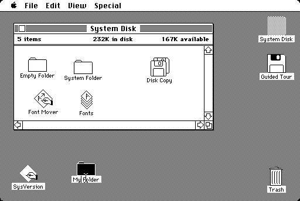
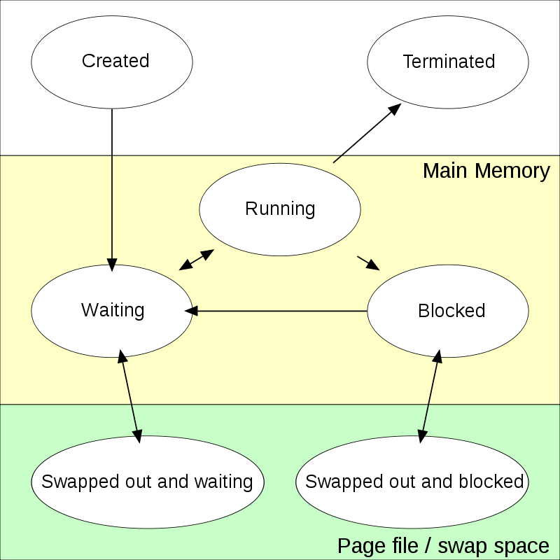
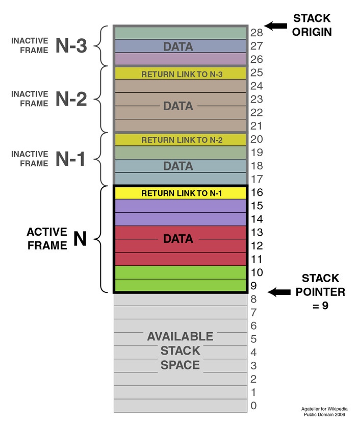
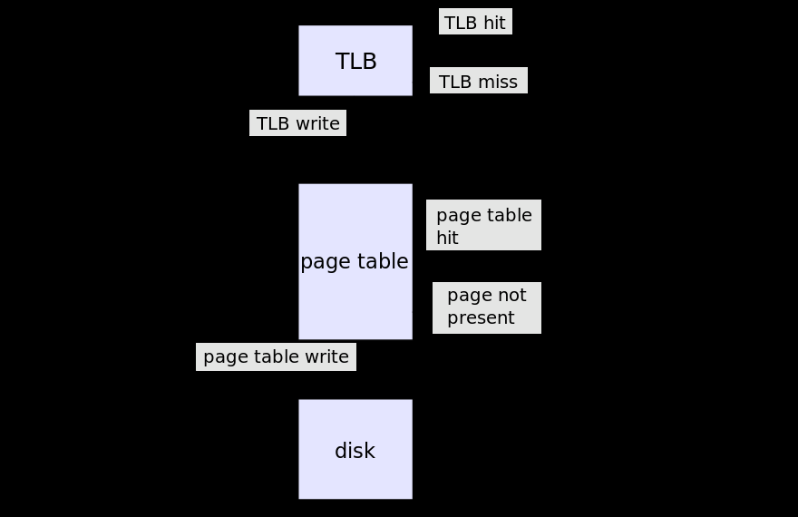
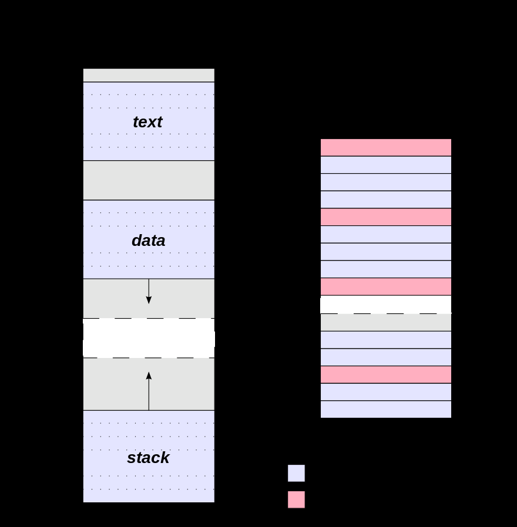

```
#define AUTHOR "Carlos Buchart"
#define COURSE "Computer Architecture"
#define UNIVERSITY "TECNUN - University of Navarra"
```

# Disclaimer
_These are my private course notes that I've decided to share in order to offer a summary of the content. It doesn't pretend to be a full-book replacement._

_Also, some content was taken from Wikipedia long time ago. When I decided to share the notes I had no list of references. I'll be updating this file to add the missing ones._

# Table of Content
-   [Basic Concepts on Operating Systems](#basic-concepts-on-operating-systems)
    -   [What an OS is?](#what-an-os-is-)
    -   [Types of OSs](#types-of-oss)
        -   [Single- and multi-tasking](#single--and-multi-tasking)
        -   [Single- and multi-user](#single--and-multi-user)
        -   [Distributed](#distributed)
        -   [Embedded](#embedded)
        -   [Real-time](#real-time)
    -   [Main operating systems](#main-operating-systems)
    -   [Kernel](#kernel)
    -   [Device drivers](#device-drivers)
    -   [Firmware](#firmware)
    -   [Callbacks](#callbacks)
    -   [Interruptions and exceptions](#interruptions-and-exceptions)
    -   [Timer](#timer)
    -   [Modes of operation](#modes-of-operation)
    -   [System calls](#system-calls)
    -   [Boot loader](#boot-loader)
    -   [Standard streams](#standard-streams)
    -   [Application Programming Interface (API)](#application-programming-interface--api-)
    -   [User Interface](#user-interface)
        -   [Command Line Interface (CLI)](#command-line-interface--cli-)
            -   [Command line arguments](#command-line-arguments)
            -   [I/O redirection](#i-o-redirection)
        -   [Graphical User Interface (GUI)](#graphical-user-interface--gui-)
-   [Process management](#process-management)
    -   [Process](#process)
        -   [Process Control Block (PCB)](#process-control-block--pcb-)
        -   [Process Lifecycle](#process-lifecycle)
            -   [Created or New](#created-or-new)
            -   [Ready and Waiting](#ready-and-waiting)
            -   [Running](#running)
            -   [Blocked](#blocked)
            -   [Terminated](#terminated)
    -   [Threads](#threads)
    -   [Programming considerations](#programming-considerations)
-   [Synchronization](#synchronization)
    -   [Race conditions](#race-conditions)
    -   [Critical section](#critical-section)
    -   [Solution](#solution)
        -   [Mutex](#mutex)
    -   [Synchronization problems](#synchronization-problems)
        -   [Producer-consumer](#producer-consumer)
        -   [Readers-writers](#readers-writers)
    -   [Deadlock](#deadlock)
        -   [Deadlock handling](#deadlock-handling)
            -   [Prevention](#prevention)
-   [Inter-process communication (IPC)](#inter-process-communication--ipc-)
    -   [Pipes](#pipes)
    -   [Files](#files)
    -   [Shared memory](#shared-memory)
        -   [POSIX example](#posix-example)
    -   [Message passing](#message-passing)
    -   [Sockets](#sockets)
-   [Main memory management](#main-memory-management)
    -   [Addressing](#addressing)
        -   [Address space](#address-space)
            -   [Stack](#stack)
            -   [Heap / Dynamic allocation](#heap---dynamic-allocation)
    -   [Memory management techniques](#memory-management-techniques)
        -   [Single contiguous allocation](#single-contiguous-allocation)
        -   [Partitioned allocation](#partitioned-allocation)
            -   [External fragmentation](#external-fragmentation)
        -   [Paging](#paging)
        -   [Virtual memory](#virtual-memory)
            -   [Page faults](#page-faults)
            -   [Page size](#page-size)
            -   [Page size versus page table size](#page-size-versus-page-table-size)
            -   [Page size versus TLB usage](#page-size-versus-tlb-usage)
            -   [Internal fragmentation of pages](#internal-fragmentation-of-pages)
            -   [Page size versus disk access](#page-size-versus-disk-access)
        -   [Segmentation](#segmentation)
    -   [Programming considerations](#programming-considerations-1)
        -   [Problems in application memory management](#problems-in-application-memory-management)
            -   [Memory leaks](#memory-leaks)
            -   [Dangling pointers and wild pointers](#dangling-pointers-and-wild-pointers)
            -   [Out-of-bound access](#out-of-bound-access)
        -   [Automatic memory management](#automatic-memory-management)
            -   [Garbage collection](#garbage-collection)
            -   [Reference counting](#reference-counting)
        -   [Standard Template Library (STL)](#standard-template-library--stl-)
            -   [Containers](#containers)
            -   [Algorithms](#algorithms)
            -   [Quick example](#quick-example)
            -   [Comparison among vector, dynamic and static arrays](#comparison-among-vector--dynamic-and-static-arrays)

<small><i><a href='http://ecotrust-canada.github.io/markdown-toc/'>Table of contents generated with markdown-toc</a></i></small>

# Basic Concepts on Operating Systems

## What an OS is?

An operating system (OS) is system software that manages computer hardware and software resources and provides common services for computer programs<sup>[^](https://en.wikipedia.org/wiki/Operating_system)</sup>. Application programs usually require an operating system to function.

## Types of OSs

### Single- and multi-tasking

A single-tasking system can only run one program at a time, while a multi-tasking operating system allows more than one program to be running in concurrency. This is achieved by time-sharing, dividing the available processor time between multiple processes which are each interrupted repeatedly in time-slices by a task scheduling subsystem of the operating system. Multi-tasking may be characterized in preemptive and co-operative types. In preemptive multitasking, the operating system slices the CPU time and dedicates a slot to each of the programs. Unix-like operating systems, e.g., Solaris, Linux, as well as AmigaOS support preemptive multitasking. Cooperative multitasking is achieved by relying on each process to provide time to the other processes in a defined manner. 16-bit versions of Microsoft Windows used cooperative multi-tasking. 32-bit versions of both Windows NT and Win9x, used preemptive multi-tasking. On the other hand, it is important to differentiate a multi-tasking OS from a multi-tasking user interface.<sup>[^](https://en.wikipedia.org/wiki/Operating_system#Single-tasking_and_multi-tasking)</sup> For example, iOS is based on Unix and it is therefore a multi-tasking OS (cellular services, user interface, music player, all are processes running at the same time), but its front-end interface didn't allow the user to execute more than one application at a time until version 4.0.

### Single- and multi-user

Single-user operating systems have no facilities to distinguish users but may allow multiple programs to run in tandem. A multi-user operating system extends the basic concept of multi-tasking with facilities that identify processes and resources, such as disk space, belonging to multiple users, and the system permits multiple users to interact with the system at the same time. Time-sharing operating systems schedule tasks for efficient use of the system and may also include accounting software for cost allocation of processor time, mass storage, printing, and other resources to multiple users.<sup>[^](https://en.wikipedia.org/wiki/Operating_system#Single-_and_multi-user)</sup>

### Distributed

A distributed operating system manages a group of distinct computers and makes them appear to be a single computer.<sup>[^](https://en.wikipedia.org/wiki/Operating_system#Distributed)</sup> The development of networked computers that could be linked and communicate with each other gave rise to distributed computing. Distributed computations are carried out on more than one machine. When computers in a group work in cooperation, they form a distributed system.

### Embedded

Embedded operating systems are designed to be used in embedded computer systems. They are designed to operate on small machines like PDAs, smartwatches or other devices with less autonomy. They are able to operate with a limited number of resources. They are very compact and extremely efficient by design. watchOS, Windows CE, Minix 3 are some examples of embedded operating systems.<sup>[^](https://en.wikipedia.org/wiki/Operating_system#Embedded)</sup>

### Real-time

A real-time operating system is an operating system that guarantees to process events or data within a certain short amount of time. A real-time operating system may be single- or multi-tasking, but when multitasking, it uses specialized scheduling algorithms so that a deterministic nature of behavior is achieved. An event-driven system switches between tasks based on their priorities or external events while time-sharing operating systems switch tasks based on clock interrupts.<sup>[^](https://en.wikipedia.org/wiki/Operating_system#Real-time)</sup>

## Main operating systems

-   Linux (including distros like Debian, Ubuntu, Fedora, CentOS, SuSE)
-   Android
-   BSD
-   macOS
-   iOS
-   FreeBSD
-   Solaris
-   Windows

## Kernel

With the aid of the firmware and device drivers, the kernel provides the most basic level of control over all the computer\'s hardware devices. It manages memory access for programs in the RAM, it determines which programs get access to which hardware resources, it sets up or resets the CPU\'s operating states for optimal operation always, and it organizes the data for long-term non-volatile storage with file systems on such media as disks, tapes, flash memory, etc.<sup>[^](https://en.wikipedia.org/wiki/Operating_system#Kernel)</sup>


## Device drivers

A device driver is the software that tells the operating system how to communicate with the device. By providing a software interface to hardware devices, a driver enables operating systems and other computer programs to access hardware functions without needing to know precise details of the hardware being used.

## Firmware

Firmware is a type of software that provides control, monitoring and data manipulation of engineered products and systems, permanently etched into the hardware. Typical examples of devices containing firmware are embedded systems (such as traffic lights, consumer appliances, and digital watches), computers, computer peripherals, mobile phones, and digital cameras, but not all devices have firmware (only devices with some _level of intelligence_). The firmware contained in these devices provides the low-level control program for the device. As of 2013, most firmware can be updated.

## Callbacks

A callback is a piece of executable code that is passed as an argument to other code, which is expected to call back (execute) the argument at some convenient time.

```
void error_func(const char* msg)
{
  printf("ERROR: %sn", msg);
}

float divide(float a, float b, void(*error_callback)(const char*))
{
  if (b == 0.0f) {
    error_callback("Divisor can't be zero");

    return 0.0f;
  }

  return a / b;
}

// ...
float c = divide(15.0f, 3.0f, error_func);
float d = divide(c, 0.0f, error_func);
// ...
```

## Interruptions and exceptions

An interrupt is a signal to the processor emitted by hardware or software indicating an event that needs immediate attention. An interrupt alerts the processor to a high-priority condition requiring the interruption of the current code the processor is executing. The processor responds by suspending its current activities, saving its state, and executing a function called an interrupt handler (or an interrupt service routine, ISR) to deal with the event. This interruption is temporary, and, after the interrupt handler finishes, the processor resumes normal activities. There are two types of interrupts: hardware interrupts and software interrupts.

Hardware interrupts are used by devices to communicate that they require attention from the operating system. Internally, hardware interrupts are implemented using electronic alerting signals that are sent to the processor from an external device, which is either a part of the computer itself, such as a disk controller, or an external peripheral.

A software interrupt is caused either by an exceptional condition in the processor itself (also called trap or exception), or a special instruction in the instruction set which causes an interrupt when it is executed.

## Timer

An operating system needs to be able to schedule an activity sometime in the future. A mechanism is needed whereby activities can be scheduled to run at some relatively precise time. Any microprocessor that wishes to support an operating system must have programmable interval timer which periodically interrupts the processor. Software timers can be used by a process to schedule the execution of a block of instructions (usually a callback). For example, a game engine can set a timer to determine the end of a magic potion, or an email client can schedule the check of new emails every 5 minutes.

## Modes of operation

Modern CPUs support multiple modes of operation. CPUs with this capability use at least two modes: protected mode and supervisor mode. The supervisor mode is used by the operating system\'s kernel for low level tasks that need unrestricted access to hardware, such as controlling how memory is written and erased, and communication with devices like graphics cards. Protected mode, in contrast, is used for almost everything else. Applications operate within protected mode and can only use hardware by communicating with the kernel, which controls everything in supervisor mode. In protected mode programs may have access to a more limited set of the CPU\'s instructions. These modes are also referred as _rings_ in some CPUs.

CPUs might have other modes similar to protected mode as well, such as the virtual modes in order to emulate older processor types, such as 16-bit processors on a 32-bit one, or 32-bit processors on a 64-bit one. In this way, the operating system can maintain exclusive control over things like access to hardware and memory.

## System calls

A system call is how a program requests a service from an [operating system](https://en.wikipedia.org/wiki/Operating_system)\'s [kernel](https://en.wikipedia.org/wiki/Kernel_(computing)). This may include hardware-related services (for example, accessing a [hard disk drive](https://en.wikipedia.org/wiki/Hard_disk_drive)), creation and execution of new processes, and communication with integral kernel services such as process scheduling. System calls provide an essential interface between a process and the operating system.

## Boot loader

A boot loader is a computer program that loads an operating system or some other system software for the computer after completion of the power-on self-tests<sup>[1](#footnote-post)</sup>; it is the loader for the operating system itself. Within the hard reboot process, it runs after completion of the self-tests, then loads and runs the software. A boot loader is loaded into main memory from persistent memory, such as a hard disk drive or, in some older computers, from a medium such as punched cards, punched tape, or magnetic tape. The boot loader then loads and executes the processes that finalize the boot. Like POST processes, the boot loader code comes from a _hard-wired_ and persistent location; if that location is too limited for some reason, that primary boot loader calls a second-stage boot loader or a secondary program loader.

## Standard streams

Standard streams are pre-connected input and output communication channels between a computer program and its environment when it begins execution. The three I/O connections are called standard input (*stdin*), standard output (*stdout*) and standard error (*stderr*). Originally, I/O happened via a physically connected system console (input via keyboard, output via monitor), but standard streams abstract this. When a command is executed via an interactive shell, the streams are typically connected to the text terminal on which the shell is running, but can be changed with redirection, e.g. via a pipeline.

```
#include <iostream>

int main()
{
  int n;
  
  std::cin >> n;
  
  float acc = 0.0f, x;
  
  for (int ii = 0; ii < n; ++ii) {
    std::cin >> x;
    acc += x;
  }
  
  if (n <= 0) {
    std::cerr << "Invalid number of elements" << std::endl;
  } else {
    const float avg = acc / n;
    std::cout << avg << std::endl;
  }
  
  return 0;
}
```

## Application Programming Interface (API)

An application programming interface (API) is a set of routines, protocols, and tools for building software applications. An API expresses a software component in terms of its operations, inputs, outputs, and underlying types, defining functionalities that are independent of their respective implementations, which allows definitions and implementations to vary without compromising the interface. A good API makes it easier to develop a program by providing all the building blocks, which are then put together by the programmer. An API may be provided by the operating system (like Linux or the Windows API), drivers (for example by the Kinect SDK<sup>[2](#footnote-sdk)</sup>), programming languages (like Java, C++ or Swift) or by third-party libraries (like Cocoa Touch).

## User Interface

The user interface is the space where interactions between humans and machines occur. The goal of this interaction is to allow effective operation and control of the machine from the human end, whilst the machine simultaneously feeds back information that aids the operators\' decision-making process. Although not strictly speaking, user interfaces evolution has been related to the evolution of operating systems.

### Command Line Interface (CLI)

Command Line Interfaces is a mean of interacting with a computer program where the user (or client) issues commands to the program in the form of successive lines of text (command lines). The interface is usually implemented with a command line shell, which is a program that accepts commands as text input and converts commands to appropriate operating system functions.

```
cat /etc/passwd | sort

ls -la
```

#### Command line arguments

A command-line argument or parameter is an item of information provided to a program when it is started. A program can have many command-line arguments that identify sources or destinations of information, or that alter the operation of the program. Although not exactly an IPC mechanism, command line arguments are a basic concept in program execution and are, combined with shell variables and I/O redirection, very useful in scripts.

When a command processor is active a program is typically invoked by typing its name followed by command-line arguments (if any). In the following example, command is marked in white and arguments in green (gray and red sections correspond to I/O redirection, explained below):

```ls -la | grep --count Do > count.txt```

  |ls       |-la                  |\|    |grep     |\--count            |Do     |\>                           |count.txt|
  |---------|---------------------|------|---------|--------------------|-------|-----------------------------|-------------
  |command  |option (short form)  |pipe  |command  |option (long form)  |value  |standard output redirection  |output file|

Some programming languages, such as C, C++ and Java, allow a program to interpret the command-line arguments by handling them as string parameters in the main function. Other languages, such as Python, expose these arguments as global variables.

C/C++ allow a program to obtain the command line arguments provided when the executable is called, using two optional parameters of `main()` named `argc` (argument count) and `argv` (argument vector).

The `argc` variable gives the count of the number of command-line parameters provided to the program. This count includes the name of the program itself, so it will always have a value of at least one. The `argv` variable is a pointer to the first element of an array of strings, with each element containing one of the command-line arguments.

Example

```
#include <stdio.h>

int main(int argc, char* argv[])
{
  for (int ii = 0; ii < argc; ++ii) {
    printf("Argument %d: %s\n", ii, argv[ii]);
  }
  
  return 0;
}
```

If called as

```./example my list of arguments```

then output will be

```
Argument 0: ./example
Argument 1: my
Argument 2: list
Argument 3: of
Argument 4: arguments
```

Some third-party libraries provide more powerful tools for command line arguments processing. One of the best ones is Boost (<http://www.boost.org)>, a C++ library that extends the standard library. Here an example of the boost::program\_options module. Please refer to the documentation for more information about it.

```
#include <string>
#include <iostream>
#include <boost/program_options.hpp>

namespace po = boost::program_options;

int main(int argc, char* argv[])
{
  po::positional_options_description po_pos_desc;
  po_pos_desc.add("output", -1);
  po::options_description po_desc("Allowed options");
  
  po_desc.add_options()
    ("help,?", "show this help message")
    ("width,w", po::value<int>()->default_value(1024), "width of the output image")
    ("height,h", po::value<int>()->default_value(768), "height of the output image")
    ("output", po::value<std::string>()->required(), "output filename")
  ;
  
  po::variables_map po_vm;
  try { // read and parse command line arguments
    po::store(po::command_line_parser(argc, argv)
              .options(po_desc).positional(po_pos_desc).run(), po_vm);
    po::notify(po_vm);
  } catch (...) { // incorrect usage
    std::cout << po_desc << std::endl;
    return 0;
  }
  
  if (po_vm.count("help")) { // print help message
    std::cout << po_desc << std::endl;
    return 0;
  }
  
  const auto width = po_vm["width"].as<int>();
  const auto height = po_vm["height"].as<int>();
  const auto output = po_vm["output"].as<std::string>();
  
  std::cout << "Output: " << output << " (" << width << "x" << height << ")" << std::endl;
  
  return 0;
}
```

#### I/O redirection

Redirection is a function common to most command-line interpreters, including the various Unix shells that can redirect standard streams to user-specified locations (usually a file). In Unix-like operating systems, a single hyphen-minus by itself is usually a special value specifying that a program should handle data coming from the standard input or send data to the standard output. Examples:

-   Executes `command` and place output in `output_file` instead of displaying it at the terminal. The content of `output_file` is replaced with each execution.

    `command > output_file`

-   Similar to previous one, but output is appended at the end of `output_file` instead of replacing.

    `command >> output_file`

-   Executes `command` with `input_file` as the source of input, as opposed to the keyboard.

    `command < input_file`

-   Executes `command` and take input from `input_file` and place output in `output_file`.

    `command < input_file > output_file`

-   Redirects the standard error stream to `error_file` and output to `output_file`.

    `command 2> error_file > output_file`

-   Redirects both `stderr` and `stdout` to the same file, merging error messages and standard output.

    `command 2>&1 output_file`

### Graphical User Interface (GUI)

A graphical user interface is a type of interface that allows users to interact with electronic devices through graphical icons and visual indicators such as secondary notation, as opposed to text-based interfaces, typed command labels or text navigation. GUIs were introduced in reaction to the perceived steep learning curve of CLIs, which require commands to be typed on the keyboard. The actions in a GUI are usually performed through direct manipulation of the graphical elements using special input devices like a mouse.



# Process management

Process management is an integral part of any modern-day operating system (OS). The OS must allocate resources to processes, enable processes to share and exchange information, protect the resources of each process from other processes and enable synchronization among processes.

Multitasking is a method to allow multiple processes to share processors (CPUs) and other system resources. Each CPU executes a single task at a time. However, multitasking allows each processor to switch between tasks that are being executed without having to wait for each task to finish. Depending on the operating system implementation, switches could be performed when tasks perform input/output operations, when a task indicates that it can be switched, or on hardware interrupts.

A common form of multitasking is time-sharing. Time-sharing is a method to allow fast response for interactive user applications. In time-sharing systems, context switches are performed rapidly, which makes it seem like multiple processes are being executed simultaneously on the same processor. This seeming execution of multiple processes simultaneously is called concurrency.

For security and reliability, most modern operating systems prevent direct communication between independent processes, providing strictly mediated and controlled inter-process communication functionality.

## Process

In computing, a process is an instance of a computer program that is being executed. It contains the program code and its current activity. Depending on the operating system (OS), a process may be made up of multiple threads of execution that execute instructions concurrently.

A computer program is a passive collection of instructions; a process is the actual execution of those instructions. Several processes may be associated with the same program; for example, opening several instances of the same program often means more than one process is being executed.

### Process Control Block (PCB)

In general, a computer system process consists of (or is said to own) the following resources:

-   An image of the executable machine code associated with a program.
-   Memory (typically some region of virtual memory); which includes the executable code, process-specific data (input and output), a call stack (to keep track of active subroutines and/or other events), and a heap to hold intermediate computation data generated during run time.
-   Operating system descriptors of resources that are allocated to the process, such as file descriptors (Unix terminology) or handles (Windows), and data sources and sinks.
-   Security attributes, such as the process owner and the process\' set of permissions (allowable operations).
-   Processor state (context), such as the content of registers, physical memory addressing, etc. The state is typically stored in computer registers when the process is executing, and in memory otherwise.

The operating system holds most of this information about active processes in data structures called _process control blocks_. Any subset of the resources, typically at least the processor state, may be associated with each of the process\' threads in operating systems that support threads or child (daughter) processes.

### Process Lifecycle

n a multitasking computer system, processes may occupy a variety of states. These distinct states may not actually be recognized as such by the operating system kernel. However, they are a useful abstraction for the understanding of processes.



#### Created or New

When a process is first created, it occupies the _created_ or _new_ state. In this state, the process awaits admission to the _ready_ state. This admission will be approved or delayed by a long-term, or admission, scheduler. Typically, in most desktop computer systems, this admission will be approved automatically. However, for real-time operating systems this admission may be delayed. In a real-time system, admitting too many processes to the _ready_ state may lead to over-saturation and over-contention for the systems resources, leading to an inability to meet process deadlines.

On POSIX operating systems (like UNIX, macOS and Linux) a new process is created using the `fork` function. For a process to start the execution of a different program, it first forks to create a copy of itself. Then, the copy, called the _child process_, calls the exec system call to overlay itself with the other program: it ceases execution of its former program in favor of the other. When a process is copied, the entire PCB is duplicated and new address spaces are created, so even when variables and pointers have same values they are actually different elements. The fork function can be speeded up if copy-on-write semantics are implemented: in this case, the memory is not actually duplicated until any of the processes wants to modify it. If only read operations are executed, then both processes are using exactly the same memory elements. This can be implemented at page level, increasing even more the efficiency of the fork at the expense of higher latency in further operations.

```
#include <stdio.h>
#include <sys/types.h>
#include <unistd.h>
#define MAX_COUNT 5

int main()
{
  pid_t pid;
  int ii;
  float a = 4.3f;
  
  printf("Original %d\n", getpid());
  
  if (fork() != 0) {
    a = 1.0f;
    
    printf("Parent!!!\n");
    printf("pid %d, a %f\n", getpid(), a);
  } else {
    a = 2.0f;
    
    pid = getpid();
    printf("pid %d, a %f\n", pid, a);
    
    for (ii = 1; ii <= MAX_COUNT; ++ii) {
      printf("pid %d, val %d\n", pid, ii);
    }
  }
  
  return 0;
}
```

On Windows systems, a new process is started using the `CreateProcess` function, specifying the command or application to be executed as well as different properties and context information.

#### Ready and Waiting

A _ready_ or _waiting_ process has been loaded into main memory and is awaiting execution on a CPU (to be context switched onto the CPU by the dispatcher, or short-term scheduler). There may be many _ready_ processes at any one point of the system\'s execution---for example, in a one-processor system, only one process can be executing at any one time, and all other _concurrently executing_ processes will be waiting for execution.

A ready queue or run queue is used in computer scheduling. Modern computers can run many different programs or processes at the same time. However, the CPU is only capable of handling one process at a time (multi-core CPUs or systems with multiple CPUs, on the other hand, can run several processes at the same time). Processes that are ready for the CPU are kept in a queue for _ready_ processes. Other processes that are waiting for an event to occur, such as loading information from a hard drive or waiting on an internet connection, are not in the ready queue.

#### Running

A process moves into the running state when it is chosen for execution. The process\'s instructions are executed by one of the CPUs (or cores) of the system. There is at most one running process per CPU or core.

#### Blocked

A process that is blocked is one that is waiting for some event, such as a resource becoming available or the completion of an I/O operation.

#### Terminated

A process may be terminated, either from the _running_ state by completing its execution or by explicitly being killed. In either of these cases, the process moves to the _terminated_ state. The underlying program is no longer executing, but the process remains in the process table as a zombie process until its parent process calls the wait system call to read its exit status, at which point the process is removed from the process table, finally ending the process\'s lifetime. If the parent fails to call wait, this continues to consume the process table entry (concretely the process identifier or PID) and causes a resource leak.

## Threads

A thread is the smallest sequence of programmed instructions that can be managed independently by a scheduler, which is typically a part of the operating system. The implementation of threads and processes differs between operating systems, but in most cases a thread is a component of a process. Multiple threads can exist within the same process, executing concurrently (one starting before others finish) and share resources such as memory, while different processes do not share these resources. In particular, the threads of a process share its instructions (executable code) and its context (the values of its variables at any given moment).

On a single processor, multithreading is generally implemented by time slicing (as in multitasking), and the central processing unit (CPU) switches between different software threads. This context switching generally happens frequently enough that the user perceives the threads or tasks as running at the same time (in parallel). On a multiprocessor or multi-core system, multiple threads can be executed in parallel (at the same instant), with every processor or core executing a separate thread simultaneously; on a processor or core with hardware threads, separate software threads can also be executed concurrently by separate hardware threads.

Threads differ from traditional multitasking operating system processes in that:

-   processes are typically independent, while threads exist as subsets of a process
-   processes carry considerably more state information than threads, whereas multiple threads within a process share process state as well as memory and other resources
-   processes have separate address spaces, whereas threads share their address space
-   processes interact only through system-provided inter-process communication mechanisms
-   context switching between threads in the same process is typically faster than context switching between processes.

Multithreading is mainly found in multitasking operating systems. Multithreading is a widespread programming and execution model that allows multiple threads to exist within the context of a single process. These threads share the process\'s resources, but are able to execute independently. The threaded programming model provides developers with a useful abstraction of concurrent execution. Multithreading can also be applied to a single process to enable parallel execution on a multiprocessing system.

Multithreaded applications have the following advantages:

-   **Responsiveness**: multithreading can allow an application to remain responsive to input. In a single-threaded program, if the main execution thread blocks on a long-running task, the entire application can appear to freeze. By moving such long-running tasks to a worker thread that runs concurrently with the main execution thread, it is possible for the application to remain responsive to user input while executing tasks in the background. On the other hand, in most cases multithreading is not the only way to keep a program responsive, with non-blocking I/O and/or Unix signals being available for gaining similar results.
-   **Faster execution**: this advantage of a multithreaded program allows it to operate faster on computer systems that have multiple CPUs or one or more multi-core CPUs, or across a cluster of machines, because the threads of the program naturally lend themselves to parallel execution, assuming sufficient independence (that they do not need to wait for each other).
-   **Lower resource consumption**: using threads, an application can serve multiple clients concurrently using fewer resources than it would need when using multiple process copies of itself. For example, the Apache HTTP server uses thread pools: a pool of listener threads for listening to incoming requests, and a pool of server threads for processing those requests.
-   **Better system utilization**: as an example, a file system using multiple threads can achieve higher throughput and lower latency since data in a faster medium (such as cache memory) can be retrieved by one thread while another thread retrieves data from a slower medium (such as external storage) without either thread waiting for the other to complete.
-   **Simplified sharing and communication**: unlike processes, which require a message passing or shared memory mechanism to perform inter-process communication (IPC), threads can communicate through data, code and files they already share.
-   **Parallelization**: applications looking to utilize multicore or multi-CPU systems can use multithreading to split data and tasks into parallel subtasks and let the underlying architecture manage how the threads run, either concurrently on a single core or in parallel on multiple cores. GPU computing environments like CUDA and OpenCL use the multithreading model where dozens to hundreds of threads run in parallel on a large number of cores.

Multithreading has the following drawbacks:

-   **Synchronization**: since threads share the same address space, the programmer must be careful to avoid race conditions and other non-intuitive behaviors. In order for data to be correctly manipulated, threads will often need to rendezvous in time in order to process the data in the correct order. Threads may also require mutually exclusive operations (often implemented using semaphores) in order to prevent common data from being simultaneously modified or read while in the process of being modified. Careless use of such primitives can lead to deadlocks.
-   **Thread crash crashes the whole process**: an illegal operation performed by a thread crashes the entire process; therefore, one misbehaving thread can disrupt the processing of all the other threads in the application.

## Programming considerations

There are many ways to create threads depending on the target operating system, programming language and APIs used. For example, .Net (for C\#), the Win32 API (C/C++ in Windows), pthreads (C/C++ in POSIX systems), Qt (C++ multi-platform), Boost (C++ multi-platform), Grand Central Dispatch (Objective C and Swift in macOS and iOS), and so on. Starting with C++11 the language provides standard and multi-platform support for threads. In the following code an example of its use is exposed.

```
#include <thread>
#include <iostream>
#include <vector>

void thread_function(int a_number)
{
  while (--a_number >= 0) {
    std::cout << std::this_thread::get_id() << ": " << a_number << std::endl;
  }
}

int main()
{
  std::vector<std::thread> some_threads;
  
  for (int ii = 0; ii < 6; ++ii) {
    // Create threads, each executing the same function but with different arguments
    some_threads.emplace_back(thread_function, ii * 2 + 1);
  }
	
	// Any other tasks in main thread
  
  for (size_t ii = 0; ii < some_threads.size(); ++ii) {
    some_threads[ii].join(); // wait until thread finishes
  }
  
  return 0;
}
```

# Synchronization

Synchronization is defined as a mechanism which ensures that two or more concurrent processes or threads do not simultaneously execute some particular program segment known as critical section. When one thread starts executing the critical section (serialized segment of the program) the other thread should wait until the first thread finishes. If proper synchronization techniques are not applied, it may cause a race condition where, the values of variables may be unpredictable and vary depending on the timings of context switches of the processes or threads.

## Race conditions

A race condition or race hazard is the behavior of an electronic, software or other system where the output is dependent on the sequence or timing of other uncontrollable events. It becomes a bug when events do not happen in the order the programmer intended. The term originates with the idea of two signals racing each other to influence the output first.

Race conditions arise in software when an application depends on the sequence or timing of processes or threads for it to operate properly. Critical race conditions often happen when the processes or threads depend on some shared state. Operations upon shared states are critical sections that must be mutually exclusive. Failure to obey this rule opens the possibility of corrupting the shared state.

The memory model defined in the C11 and C++11 standards uses the term _data race_ for a critical race condition caused by concurrent reads and writes of a shared memory location. A C or C++ program containing a data race has undefined behavior.

Race conditions have a reputation of being difficult to reproduce and debug, since the result is nondeterministic and depends on the relative timing between interfering threads. Problems occurring in production systems can therefore disappear when running in debug mode, when additional logging is added, or when attaching a debugger. It is therefore better to avoid race conditions by careful software design rather than attempting to fix them afterwards.

In file systems, two or more programs may collide in their attempts to modify or access a file, which could result in data corruption. File locking provides a commonly used solution. A more cumbersome remedy involves organizing the system in such a way that one unique process (running a daemon or the like) has exclusive access to the file, and all other processes that need to access the data in that file do so only via inter-process communication with that one process. This requires synchronization at the process level.

## Critical section

In concurrent programming, a critical section is a part of a multi-process program that may not be concurrently executed by more than one of the program\'s processes. In other words, it is a piece of a program that requires mutual exclusion of access. Typically, the critical section accesses a shared resource, such as a data structure, a peripheral device, or a network connection, that does not allow multiple concurrent accesses.

A critical section may consist of multiple discontiguous parts of the program\'s code. For example, one part of a program might read from a file that another part wishes to modify. These parts together form a single critical section, since simultaneous readings and modifications may interfere with each other.

A critical section will usually terminate in finite time, and a thread, task, or process will have to wait for a fixed time to enter it (aka bounded waiting). Some synchronization mechanism is required at the entry and exit of the critical section to ensure exclusive use.

## Solution

By carefully controlling which resources are modified inside and outside the critical section, concurrent access to that state is prevented. A critical section is typically used when a multithreaded program must update multiple related variables without a separate thread making conflicting changes to that data. In a related situation, a critical section may be used to ensure a shared resource, for example a printer, can only be accessed by one process at a time.

Four conditions are necessary to have a good solution to the critical section problem:

-   No two processes may be at the same moment inside their critical sections.

-   No assumptions are made about relative speeds of processes or number of CPUs.

-   No process outside its critical section should block other processes.

-   No process should wait arbitrary long to enter its critical section.

### Mutex

A mutex (from_mut_ual _ex_clusion) is a synchronization primitive that can be used to protect shared data from being simultaneously accessed by multiple threads. It offers exclusive, non-recursive ownership semantics:

-   A calling thread owns a mutex from the time that it successfully calls either `lock` or `try_lock` until it calls `unlock`.

-   When a thread owns a mutex, all other threads will block (for calls to `lock`) or receive a false return value (for `try_lock`) if they attempt to claim ownership of the mutex.

-   A calling thread must not own the mutex prior to calling `lock` or `try_lock`.

In addition, a lock guard (`lock_guard` in C++11) is a mutex wrapper that provides a convenient mechanism for owning a mutex for the duration of a scoped block.

When a lock guard object is created, it attempts to take ownership of the mutex it is given. When control leaves the scope in which the lock guard object was created, the lock guard is destructed and the mutex is released.

Example:

```
#include <mutex>

std::mutex a_mutex;

void thread_func()
{
  a_mutex.lock();
  // Critical section
  a_mutex.unlock();
}

void thread_func_non_blocking()
{
  if (a_mutex.try_lock()) {
    // Critical section
    a_mutex.unlock();
  }
}

void thread_func_with_lock_guard()
{
  std::lock_guard<std::mutex> lock(a_mutex);
  // Critical section
}
```

## Synchronization problems

### Producer-consumer

The producer--consumer problem (also known as the _bounded-buffer problem_) is a classic example of a multi-process synchronization problem. The problem describes two processes, the producer and the consumer, who share a common, fixed-size buffer used as a queue. The producer\'s job is to generate a piece of data, put it into the buffer and start again. At the same time, the consumer is consuming the data (i.e., removing it from the buffer) one piece at a time. The problem is to make sure that the producer won\'t try to add data into the buffer if it\'s full and that the consumer won\'t try to remove data from an empty buffer.

The solution for the producer is to either go to sleep or discard data if the buffer is full. The next time the consumer removes an item from the buffer, it notifies the producer, who starts to fill the buffer again. In the same way, the consumer can go to sleep if it finds the buffer to be empty. The next time the producer puts data into the buffer, it wakes up the sleeping consumer. The solution can be reached by means of inter-process communication, typically using semaphores. An inadequate solution could result in a deadlock where both processes are waiting to be awakened. The problem can also be generalized to have multiple producers and consumers.

A circular buffer can be used to store the produced data. Producer adds data to the buffer computing the next available index as `next_position = (next_position + 1) % max_buffer_size`, but it usually complicates the design of consumers, since processing speed is not guaranteed to be constant and therefore empty spaces in the buffer may not be contiguous, probably blocking the producer or discarding information when there was available space to store new items.

A more general and useful solution is as follows: both the producer and the consumer will share a fixed-size buffer, a list of available positions, and a list of items ready to be processed. To avoid race conditions, both lists will have a lock to control access. When the producer wants to add an element, it will take the first available index (if the list is empty means there are not any free slot and the producer will discard the item), copy the element into the buffer and add the index to the ready list. When a consumer wants to process an item it follows similar steps: takes an index from the ready list, processes it and returns the index to the available list.

### Readers-writers

The readers-writers problems are examples of a common computing problem in concurrency. There are at least three variations of the problems, which deal with situations in which many threads try to access the same shared resource at one time. Some threads may read and some may write, with the constraint that no process may access the share for either reading or writing, while another process is in the act of writing to it (it is allowed for two or more readers to access the share at the same time). A readers-writer lock is a data structure that solves one or more of the readers-writers problems.

## Deadlock

A deadlock is a situation in which two or more competing actions are each waiting for the other to finish, and thus neither ever does.

In an operating system, a deadlock is a situation which occurs when a process or thread enters a waiting state because a resource requested is being held by another waiting process, which in turn is waiting for another resource held by another waiting process. If a process is unable to change its state indefinitely because the resources requested by it are being used by another waiting process, then the system is said to be in a deadlock.

Deadlock is a common problem in multiprocessing systems, parallel computing and distributed systems, where software and hardware locks are used to handle shared resources and implement process synchronization.

Four conditions must be satisfied to generate a deadlock:

-   Mutual Exclusion Condition: The resources involved are non-shareable. At least one resource (thread) must be held in a non-shareable mode, that is, only one process at a time claims exclusive control of the resource. If another process requests that resource, the requesting process must be delayed until the resource has been released.

-   Hold and Wait Condition: Requesting process hold already owned resources while waiting for requested resources. There must exist a process that is holding a resource already allocated to it while waiting for additional resource that are currently being held by other processes.

-   No-Preemptive Condition: Resources already allocated to a process cannot be preempted. Resources cannot be removed from the processes are used to completion or released voluntarily by the process holding it.

-   Circular Wait Condition: The processes in the system form a circular list or chain where each process in the list is waiting for a resource held by the next process in the list.

### Deadlock handling

Most current operating systems cannot prevent a deadlock from occurring. When a deadlock occurs, different operating systems respond to them in different non-standard manners. Most approaches work by preventing one of the four conditions from occurring, especially the fourth one. Other major approaches include ignoring the deadlock by assuming it will never occur (usually employed when the time interval between deadlocks is large and data loss is tolerable) and detection (less employed due to the added overhead).

#### Prevention

Deadlock prevention works by preventing one of the four conditions from occurring.

-   Removing the mutual exclusion condition means that no process will have exclusive access to a resource. This proves impossible for resources that cannot be spooled. But even with spooled resources, deadlock could still occur. Algorithms that avoid mutual exclusion are called non-blocking synchronization algorithms.

-   The hold and wait or resource holding conditions may be removed by requiring processes to request all the resources they will need before starting up (or before embarking upon a particular set of operations). This advance knowledge is frequently difficult to satisfy and, in any case, is an inefficient use of resources. Another way is to require processes to request resources only when it has none. Thus, first they must release all their currently held resources before requesting all the resources they will need from scratch. This too is often impractical. It is so because resources may be allocated and remain unused for long periods. Also, a process requiring a popular resource may have to wait indefinitely, as such a resource may always be allocated to some process, resulting in resource starvation.

-   The no preemption condition may also be difficult or impossible to avoid as a process must be able to have a resource for a certain amount of time, or the processing outcome may be inconsistent or thrashing may occur. However, inability to enforce preemption may interfere with a priority algorithm. Preemption of a _locked out_ resource generally implies a rollback, and is to be avoided, since it is very costly in overhead. Algorithms that allow preemption include lock-free and wait-free algorithms and optimistic concurrency control. If a process holding some resources and requests for some another resource(s) that cannot be immediately allocated to it, the condition may be removed by releasing all the currently being held resources of that process.

-   The final condition is the circular wait condition. Approaches that avoid circular waits include disabling interrupts during critical sections and using a hierarchy to determine a partial ordering of resources. If no obvious hierarchy exists, even the memory address of resources has been used to determine ordering and resources are requested in the increasing order of the enumeration.

# Inter-process communication (IPC)

Inter-process communication (IPC) refers specifically to the mechanisms an operating system provides to allow processes it manages to share data. Typically, applications can use IPC categorized as clients and servers, where the client requests data and the server responds to client requests. Many applications are both clients and servers, as commonly seen in distributed computing.

## Pipes

Programs can be run together such that one program reads the output from another with no need for an explicit intermediate file. This is called piping. The two programs performing the commands may run in parallel with the only storage space being working buffers (Linux allows up to 64K for each buffer) plus whatever work space each command\'s processing requires. In the following example, `command2` takes the output of `command1` as the source of input.

command1 \| command2

This produces the same result as using two redirects and a temporary file, as in:

command1 \> tmp\_file

command2 \< tmp\_file

rm tmp\_file

But here, `command2` does not start executing until `command1` has finished, and a sufficiently large scratch file is required to hold the intermediate results as well as whatever work space each task requires.

## Files

A record stored on disk, or a record synthesized on demand by a file server, can be accessed by multiple processes. A typical example is a database, where processes can write to and read data from a common place. Files allow asynchronous communication and don't require processes to be in execution at the same time. On the other hand, the speed of the permanent storage used penalizes directly the communication bandwidth and synchronization mechanisms are more elaborate as well as more OS-dependent.

## Shared memory

_Shared memory_ is [memory](https://en.wikipedia.org/wiki/Random-access_memory) that may be simultaneously accessed by multiple programs with an intent to provide communication among them or avoid redundant copies. Depending on context, programs may run on a single processor or on multiple separate processors.<sup>[3](#footnote-shared-memory)</sup>

Since both processes can access the shared memory area like regular working memory, this is a very fast way of communication. On the other hand, it is less scalable, as for example the communicating processes must be running on the same machine (of other IPC methods, only Internet domain sockets can use a [computer network](https://en.wikipedia.org/wiki/Computer_network)), and care must be taken to avoid issues if processes sharing memory are running on separate CPUs and the underlying architecture is not [cache coherent](https://en.wikipedia.org/wiki/Cache_coherence).

### POSIX example

The following example demonstrates the use of shared memory in POSIX environments (like Linux or macOS), and consists of two programs, a producer writing messages into the shared region, and a consumer reading and displaying it on the screen.<sup>[4](#footnote-gcc)</sup>

Producer (inspired from [this one](http://www.cse.psu.edu/~deh25/cmpsc473/notes/OSC/Processes/shm-posix-producer-orig.c)):
```
#include <stdio.h>
#include <stdlib.h>
#include <string.h>
#include <fcntl.h>
#include <sys/shm.h>
#include <sys/stat.h>
#include <sys/mman.h>

int main()
{
  const int SIZE = 4096;
  const char *name = "OS";
  const char *message0 = "Studying ";
  const char *message1 = "Operating Systems ";
  const char *message2 = "Is Fun!";
  
  /* Create the shared memory segment */
  int shm_fd = shm_open(name, O_CREAT | O_RDWR, 0666);
  
  /* Configure the size of the shared memory segment */
  ftruncate(shm_fd, SIZE);
  
  /* Now map the shared memory segment in the address space of the process */
  void* ptr = mmap(0, SIZE, PROT_READ | PROT_WRITE, MAP_SHARED, shm_fd, 0);
  
  if (ptr == MAP_FAILED) {
    printf("Map failed\n");
    return -1;
  }
  
  /*
  * Now write to the shared memory region
  * Note we must increment the value of ptr after each write
  */
  
  sprintf(ptr, "%s", message0);
  ptr += strlen(message0);
  
  sprintf(ptr, "%s", message1);
  ptr += strlen(message1);
  
  sprintf(ptr, "%s", message2);
  ptr += strlen(message2);
  
  return 0;
}
```

Consumer (inspired from [this one](http://www.cse.psu.edu/~deh25/cmpsc473/notes/OSC/Processes/shm-posix-consumer-orig.c)):
```
#include <stdio.h>
#include <stdlib.h>
#include <fcntl.h>
#include <sys/shm.h>
#include <sys/stat.h>
#include <sys/mman.h>

int main()
{
  const char *name = "OS";
  const int SIZE = 4096;
  
  /* Open the shared memory segment */
  int shm_fd = shm_open(name, O_RDONLY, 0666);
  
  if (shm_fd == -1) {
    printf("shared memory failed\n");
    exit(-1);
  }
  
  /* Now map the shared memory segment in the address space of the process */
  void* ptr = mmap(0, SIZE, PROT_READ, MAP_SHARED, shm_fd, 0);
  
  if (ptr == MAP_FAILED) {
    printf("Map failed\n");
    return -1;
  }
  
  /* Now read from the shared memory region */
  printf("%s", ptr);
  
  /* Remove the shared memory segment */
  if (shm_unlink(name) == -1) {
    printf("Error removing %s\n", name);
    return -1;
  }
  
  return 0;
}
```

## Message passing

Message passing sends a message to a process (which may be an actor or object) and relies on the process and the supporting infrastructure to select and invoke the actual code to run. Message passing differs from conventional programming where a process, subroutine, or function is directly invoked by name. Message passing is key to some models of concurrency and object-oriented programming.

Message passing is used ubiquitously in modern computer software. It is used as a way for the objects that make up a program to work with each other and as a way for objects and systems running on different computers (e.g., the Internet) to interact. Message passing may be implemented by various mechanisms, including channels.

## Sockets

A network socket is an endpoint of a connection across a computer network. Today, most communication between computers is based on the Internet Protocol; therefore, most network sockets are Internet sockets. More precisely, a socket is a handle (an abstract reference) that a local program can pass to the networking API to use the connection, for example _send this data on this socket_. Sockets are internally often simply integers, that identify which connection to use.

A socket API is usually provided by the operating system and allows application programs to control and use network sockets<sup>[5](#footnote-socket)</sup>. Internet socket APIs are usually based on the Berkeley sockets standard. In the Berkeley sockets standard, sockets are a form of file descriptor (a file handle), due to the Unix philosophy that _everything is a file_, and the analogies between sockets and files: you can read, write, open, and close both. In practice the differences mean the analogy is strained, and one instead use different interfaces (send and receive) on a socket. In inter-process communication, each end will generally have its own socket, but these may use different APIs: they are abstracted by the network protocol.

A socket address is the combination of an IP address and a port number, much like one end of a telephone connection is the combination of a phone number and an extension. Sockets need not have an address (for example for only sending data), but if a program binds a socket to an address, the socket can be used to receive data sent to that address. Based on this address, internet sockets deliver incoming data packets to the appropriate application process or thread.

Computer processes that provide application services are referred to as servers and create sockets on start-up that are in listening state. These sockets are waiting for initiatives from client programs.

A TCP (Transmission Control Protocol) server may serve several clients concurrently, by creating a child process for each client and establishing a TCP connection between the child process and the client. Unique dedicated sockets are created for each connection. These are in established state when a socket-to-socket virtual connection or virtual circuit (VC), also known as a TCP session, is established with the remote socket, providing a duplex byte stream.

A server may create several concurrently established TCP sockets with the same local port number and local IP address, each mapped to its own server-child process, serving its own client process. They are treated as different sockets by the operating system, since the remote socket address (the client IP address and/or port number) are different; i.e. since they have different socket pair tuples.

# Main memory management

Memory management is the act of managing computer memory at the system level. The essential requirement of memory management is to provide ways to dynamically allocate portions of memory to programs at their request, and free it for reuse when no longer needed. This is critical to any advanced computer system where more than a single process might be underway at any time. Since the precise location of the allocation is not known in advance, the memory is accessed indirectly, usually through a pointer reference. The specific algorithm used to organize the memory area and allocate and deallocate chunks is interlinked with the kernel.

Several methods have been devised that increase the effectiveness of memory management. Virtual memory systems separate the memory addresses used by a process from actual physical addresses, allowing separation of processes and increasing the effectively available amount of RAM using paging or swapping to secondary storage. The quality of the virtual memory manager can have an extensive effect on overall system performance.

## Addressing

A memory address is a data concept used at various levels by software and hardware to access the computer\'s primary storage memory. Memory addresses are fixed-length sequences of digits conventionally displayed and manipulated as unsigned integers. Such numerical semantic bases itself upon features of CPU (such as the instruction pointer and incremental address registers), as well upon use of the memory like an array endorsed by various programming languages.

A digital computer\'s memory, more specifically main memory, consists of many memory locations, each having a _physical address_, a code, which the CPU (or other device) can use to access it. Generally, only system software, i.e. the [BIOS](https://en.wikipedia.org/wiki/BIOS), operating systems, and some specialized utility programs (e.g., memory testers), address physical memory using machine code operands or processor registers, instructing the CPU to direct a hardware device, called the memory controller, to use the memory bus or system bus, or separate control, address and data busses, to execute the program\'s commands.

A computer program uses memory addresses to execute machine code, store and retrieve data. Most application programs do not have a knowledge about physical addresses. Rather, they address _logical addresses_, or virtual addresses, using computer\'s memory management unit and operating system memory mapping.

### Address space

In modern multitasking environment, an application process usually has in its address space (or spaces) chunks of memory of following types:

-   Machine code, including:
    -   program\'s own code (historically known as code segment or text segment);
    -   shared libraries.
-   Data, including:
    -   initialized data (data segment);
    -   uninitialized (but allocated) variables;
    -   run-time stack;
    -   heap;
    -   shared memory and memory mapped files.

Some parts of address space may be not mapped at all.

#### Stack

Stacks in computing architectures are regions of memory where data is added (_push_ operation) or removed (_pop_ operation) in a last-in-first-out (LIFO) manner.

In most modern computer systems, each thread has a reserved region of memory referred to as its stack. When a function executes, it may add some of its state data to the top of the stack; when the function exits it is responsible for removing that data from the stack. Other data stored in the stack includes local variables, return point, function parameters.

Because the data is added and removed in a LIFO manner, stack-based memory allocation is very simple and typically faster than heap-based memory allocation (also known as dynamic memory allocation). Another feature is that memory on the stack is automatically, and very efficiently, reclaimed when the function exits, which can be convenient for the programmer if the data is no longer required. If, however, the data needs to be kept in some form, then it must be copied from the stack before the function exits. Therefore, stack-based allocation is suitable for temporary data or data which is no longer required after the creating function exits.

A thread\'s assigned stack size can be as small as a few dozen kilobytes. Allocating more memory on the stack than is available can result in a crash due to stack overflow.



#### Heap / Dynamic allocation

The task of fulfilling an allocation request consists of locating a block of unused memory of sufficient size. Memory requests are satisfied by allocating portions from a large pool of memory called the heap. At any given time, some parts of the heap are in use, while some are _free_ (unused) and thus available for future allocations.

Several issues complicate the implementation, such as external fragmentation, which arises when there are many small gaps between allocated memory blocks, which invalidates their use for an allocation request. The memory management system must track outstanding allocations to ensure that they do not overlap, and that no memory is ever _lost_ as a memory leak. The specific dynamic memory allocation algorithm implemented can impact performance significantly.

## Memory management techniques

The virtual addresses space is always seen by applications as a contiguous block of memory. A physical address can only be used by an application at a time, and the operating system uses different mapping methods to optimize the use of memory.

### Single contiguous allocation

Single allocation is the simplest memory management technique. All the computer\'s memory, usually with the exception of a small portion reserved for the operating system, is available to the single application. MS-DOS is an example of a system which allocates memory in this way. An embedded system running a single application might also use this technique.

### Partitioned allocation

Partitioned allocation divides primary memory into multiple memory partitions, usually contiguous areas of memory. Each partition might contain all the information for a specific job or task. Memory management consists of allocating a partition to a job when it starts and un-allocating it when the job ends.

Re-allocable partitions are able to be compacted to provide larger chunks of contiguous physical memory. Compaction moves _in-use_ areas of memory to eliminate _holes_ or unused areas of memory caused by process termination in order to create larger contiguous free areas.

Some systems allow partitions to be swapped out to secondary storage to free additional memory. When a partition is on secondary storage it cannot be used until it is swapped back in. Swapping increases multi-tasking in the system at expenses of slower performance due to the additional time required for each transfer.

#### External fragmentation

External fragmentation arises when free memory is separated into small blocks and is interspersed by allocated memory. It is a weakness of certain storage allocation algorithms, when they fail to order memory used by programs efficiently. The result is that, although free storage is available, it is effectively unusable because it is divided into pieces that are too small individually to satisfy the demands of the application. The term _external_ refers to the fact that the unusable storage is outside the allocated regions.

For example, consider a situation wherein a program allocates 3 continuous blocks of memory and then frees the middle block. The memory allocator can use this free block of memory for future allocations. However, it cannot use this block if the memory to be allocated is larger in size than this free block.

External fragmentation also occurs in file systems as many files of different sizes are created, change size, and are deleted. The effect is even worse if a file which is divided into many small pieces is deleted, because it leaves similarly small regions of free spaces.

The most severe problem caused by fragmentation is causing a process or system to fail, due to premature resource exhaustion: if a contiguous allocation is needed and cannot be satisfied, failure occurs. Fragmentation causes this to occur even if there is enough of the resource, but not a contiguous amount. For example, if a computer has 4 GiB of memory and 2 GiB are free, but the memory is fragmented in an alternating sequence of 1 MiB used, 1 MiB free, then a request for 1 contiguous GiB of memory cannot be satisfied even though 2 GiB total are free.

To avoid this, the allocator may, instead of failing, trigger a defragmentation (or memory compaction cycle) or other resource reclamation, such as a major garbage collection cycle, in the hope that it will then be able to satisfy the request. This allows the process to proceed but can severely impact performance.

### Paging

Paged allocation divides the computer\'s primary memory into fixed-size units called page frames, and the program\'s virtual address space into pages of the same size. The hardware memory management unit maps pages to frames. The physical memory can be allocated on a page basis while the address space appears contiguous. Paging is usually implemented along with virtual memory, so it will be further detailed in that section.

The CPU\'s [memory management unit (MMU)](https://en.wikipedia.org/wiki/Memory_management_unit) stores a cache of recently used mappings from the operating system\'s page table. This is called the translation look aside buffer (TLB), which is an associative cache.

When a virtual address needs to be translated into a physical address, the TLB is searched first. If a match is found (a TLB hit), the physical address is returned and memory access can continue. However, if there is no match (called a TLB miss), the handler will typically look up the address mapping in the page table to see whether a mapping exists (a page walk). If one exists, it is written back to the TLB (this must be done, as the hardware accesses memory through the TLB in a virtual memory system), and the faulting instruction is restarted (this may happen in parallel as well). This subsequent translation will find a TLB hit, and the memory access will continue.



One interesting use of [pagination is for reducing memory consumption when using dynamic libraries](https://en.wikipedia.org/wiki/Library_(computing)#Dynamic_linking) and to speed up. DLs are generally held in memory once and mapped to multiple processes, and only pages that had to be customized for the individual process (because a symbol resolved differently there) are duplicated, usually with a mechanism known as [copy-on-write](https://en.wikipedia.org/wiki/Copy-on-write) that transparently copies the page when a write is attempted, and then lets the write succeed on the private copy.

### Virtual memory

In computing, virtual memory is a memory management technique that is implemented using both hardware and software. It maps memory addresses used by a program, called virtual addresses, into physical addresses in computer memory. Main storage as seen by a process or task appears as a contiguous address space or collection of contiguous segments. The operating system manages virtual address spaces and the assignment of real memory to virtual memory. Address translation hardware in the CPU (the MMU), automatically translates virtual addresses to physical addresses. Software within the operating system may extend these capabilities to provide a virtual address space that can exceed the capacity of real memory and thus reference more memory than is physically present in the computer.

The primary benefits of virtual memory include freeing applications from having to manage a shared memory space, increased security due to memory isolation, and being able to conceptually use more memory than might be physically available, using the technique of paging.

Page tables are used to translate the virtual addresses seen by the application into physical addresses used by the hardware to process instructions; such hardware that handles this specific translation is often known as the memory management unit. Each entry in the page table holds a flag indicating whether the corresponding page is in real memory or not. If it is in real memory, the page table entry will contain the real memory address at which the page is stored. When a reference is made to a page by the hardware, if the page table entry for the page indicates that it is not currently in real memory, the hardware raises a page fault exception, invoking the paging supervisor component of the operating system.



#### Page faults

The page table lookup may fail for two reasons. The first is if there is no translation available for the virtual address, meaning that virtual address is invalid. This will typically occur because of a programming error, and the operating system must take some action to deal with the problem. On modern operating systems, it will cause a segmentation fault in the offending program.

The page table lookup may also fail if the page is not resident in physical memory. This will occur if the requested page has been moved out of physical memory to make room for another page. In this case, the page is paged out to a secondary store located on a medium such as a hard disk drive (this secondary store, or _backing store_, is often called a _swap partition_ if it is a disk partition, or a _swap file_ or _page file_ if it is a file). When this happens, the page needs to be taken from disk and put back into physical memory. A similar mechanism is used for memory-mapped files, which are mapped to virtual memory and loaded to physical memory on demand.

When physical memory is not full this is a simple operation; the page is written back into physical memory, the page table and TLB are updated, and the instruction is restarted. However, when physical memory is full, one or more pages in physical memory will need to be paged out to make room for the requested page. The page table needs to be updated to mark that the pages that were previously in physical memory are no longer there, and to mark that the page that was on disk is now in physical memory. The TLB also needs to be updated, including removal of the paged-out page from it, and the instruction restarted. Which page to page out is the subject of page replacement algorithms.

#### Page size

Page size is usually determined by processor architecture. Traditionally, pages in a system had uniform size, for example 4096 bytes. However, processor designs often allow two or more, sometimes simultaneous, page sizes due to the benefits and penalties. There are several points that can factor into choosing the best page size.

#### Page size versus page table size

A system with a smaller page size uses more pages, requiring a page table that occupies more space. For example, if a 2^32^ virtual address space is mapped to 4 KiB (2^12^ bytes) pages, the number of virtual pages is 2^20^ = (2^32^ / 2^12^). However, if the page size is increased to 32 KiB (2^15^ bytes), only 2^17^ pages are required. A multi-level paging algorithm can decrease the memory cost of allocating a large page table for each process by further dividing the page table up into smaller tables, effectively paging the page table.

#### Page size versus TLB usage

Since every access to memory must be mapped from virtual to physical address, reading the page table every time can be quite costly. Therefore, a very fast kind of cache, the Translation Look aside Buffer (TLB), is often used. The TLB is of limited size, and when it cannot satisfy a given request (a TLB miss) the page tables must be searched manually (either in hardware or software, depending on the architecture) for the correct mapping. Larger page sizes mean that a TLB cache of the same size can keep track of larger amounts of memory, which avoids the costly TLB misses.

#### Internal fragmentation of pages

Rarely do processes require the use of an exact number of pages. As a result, the last page will likely only be partially full, wasting some amount of memory. Larger page sizes increase the potential for wasted memory this way, as more potentially unused portions of memory are loaded into main memory. Smaller page sizes ensure a closer match to the actual amount of memory required in an allocation.

As an example, assume the page size is 1024KiB. If a process allocates 1025KiB, two pages must be used, resulting in 1023KiB of unused space (where one page fully consumes 1024KiB and the other only 1KiB).

Unlike other types of fragmentation, internal fragmentation is difficult to reclaim; usually the best way to remove it is with a design change. For example, in dynamic memory allocation, memory pools drastically cut internal fragmentation by spreading the space overhead over a larger number of objects.

#### Page size versus disk access

When transferring from a rotational disk, much of the delay is caused by seek time, the time it takes to correctly position the read/write heads above the disk platters. Because of this, large sequential transfers are more efficient than several smaller transfers. Transferring the same amount of data from disk to memory often requires less time with larger pages than with smaller pages.

### Segmentation

Segmented memory is the only memory management technique that does not provide the user\'s program with a _linear and contiguous address space._ Segments are areas of memory that usually correspond to a logical grouping of information such as a code procedure or a data array. Segments require hardware support in the form of a segment table which usually contains the physical address of the segment in memory, its size, and other data such as access protection bits and status (swapped in, swapped out, etc.) Addresses in a segmented system usually consist of the segment id and an offset relative to the segment base address, defined to be offset zero.

Segmentation allows better access protection than other schemes because memory references are relative to a specific segment and the hardware will not permit the application to reference memory not defined for that segment.

It is possible to implement segmentation with or without paging. Without paging support, the segment is the physical unit swapped in and out of memory if required. With paging support, pages are usually the unit of swapping and segmentation only adds an additional level of security.

## Programming considerations

### Problems in application memory management

#### Memory leaks

A memory leak is a type of resource leak that occurs when a computer program incorrectly manages memory allocations in such a way that memory which is no longer needed is not released. In object-oriented programming, a memory leak may happen when an object is stored in memory but cannot be accessed by the running code. A memory leak generally can only be diagnosed by a programmer with access to the program\'s source code.

Because they can exhaust available system memory as an application runs, memory leaks are often the cause of or a contributing factor to software aging.

A memory leak can diminish the performance of the computer by reducing the amount of available memory. Eventually, in the worst case, too much of the available memory may become allocated and all or part of the system or device stops working correctly, the application fails, or the system slows down vastly due to thrashing.

Memory leaks may not be serious or even detectable by normal means. In modern operating systems, normal memory used by an application is released when the application terminates. This means that a memory leak in a program that only runs for a short time may not be noticed and is rarely serious.

Much more serious leaks include those:

-   where the program runs for an extended time and consumes additional memory over time, such as background tasks on servers, but especially in embedded devices which may be left running for many years
-   where new memory is allocated frequently for one-time tasks, such as when rendering the frames of a computer game or animated video
-   where the program can request memory --- such as shared memory --- that is not released, even when the program terminates
-   where memory is very limited, such as in an embedded system or portable device
-   where the leak occurs within the operating system or memory manager
-   when a system device driver causes the leak
-   running on an operating system that does not automatically release memory on program termination. Often on such machines if memory is lost, it can only be reclaimed by a reboot.

#### Dangling pointers and wild pointers

Dangling pointers and wild pointers are pointers that do not point to a valid object of the appropriate type. These are special cases of memory safety violations. More generally, these are references that do not resolve to a valid destination (for example, link breaking in Internet).

Dangling pointers arise during object destruction, when an object that has an incoming reference is deleted or deallocated, without modifying the value of the pointer, so that the pointer still points to the memory location of the deallocated memory. As the system may reallocate the previously freed memory to another process, if the original program then dereferences the (now) dangling pointer, unpredictable behavior may result, as the memory may now contain completely different data. This is especially the case if the program writes data to memory pointed by a dangling pointer, a silent corruption of unrelated data may result, leading to subtle bugs that can be extremely difficult to find, or cause segmentation faults (UNIX, Linux) or general protection faults (Windows).

In many languages (e.g., the C programming language) deleting an object from memory explicitly or by destroying the stack frame on return does not alter associated pointers. The pointer still points to the same location in memory even though the reference has since been deleted and may now be used for other purposes. In the following example all *ptr1*, *ptr2* and *ptr3* become dangling pointers:

```
char* get_pointer()
{
  char c;
  return &c;
} // returns a pointer to a stack variable that is destroyed upon function exit

int main()
{
  int* ptr1;
  
  {
    int b;
    ptr1 = &b;
  } // 'b' doesn't exist anymore, but 'ptr1' is still referencing it
  
  char* ptr2 = get_pointer();
  auto ptr3 = new float[20];
  
  delete[] ptr3; // memory has been freed but 'ptr3' still has a memory direction
                   // it can be solved by assigning a 'nullptr' after deletion
  
  // ...
}
```

Wild pointers arise when a pointer is used prior to initialization to some known state, which is possible in some programming languages. They show the same erratic behavior as dangling pointers, though they are less likely to stay undetected. Main solution starts with a strict programming methodology that force all variables and member attribute to be initialized.

#### Out-of-bound access

Index checking means that, in all expressions indexing an array, the index value is checked against the bounds of the array (which were established when the array was defined), and if the index is out-of-bounds, further execution is suspended via some sort of error. Because using a number outside of the upper range in an array may cause the program to crash, or may introduce security vulnerabilities (see below), index checking is a part of many high-level languages. On the other hand, many programming languages, such as C, never perform automatic bounds checking to raise speed. However, this leaves many off-by-one errors and buffer overflows uncaught.

A buffer overflow, or buffer overrun, is an anomaly where a program, while writing data to a buffer, overruns the buffer\'s boundary and overwrites adjacent memory locations. This is a special case of the violation of memory safety.

Buffer overflows can be triggered by inputs that are designed to execute code or alter the way the program operates. This may result in erratic program behavior, including memory access errors, incorrect results, a crash, or a breach of system security. Thus, they are the basis of many software vulnerabilities and can be maliciously exploited.

### Automatic memory management

#### Garbage collection

**Garbage collection** (**GC**) is a form of automatic [memory management](https://en.wikipedia.org/wiki/Memory_management). The *garbage collector*, or just *collector*, attempts to reclaim [*garbage*](https://en.wikipedia.org/wiki/Garbage_(computer_science)), or memory occupied by [objects](https://en.wikipedia.org/wiki/Object_(computer_science)) that are no longer in use by the [program](https://en.wikipedia.org/wiki/Application_software).

Garbage collection is often portrayed as the opposite of [manual memory management](https://en.wikipedia.org/wiki/Manual_memory_management), which requires the programmer to specify which objects to deallocate and return to the memory system. Like other memory management techniques, garbage collection may take a significant proportion of total processing time in a program and, as a result, can have significant influence on performance.

Garbage collection frees the programmer from manually dealing with memory deallocation. As a result, certain categories of bugs are eliminated or substantially reduced:

-   **Dangling pointer bugs**, which occur when a piece of memory is freed while there are still pointers to it, and one of those pointers is dereferenced. By then the memory may have been reassigned to another use, with unpredictable results.
-   **Double free bugs**, which occur when the program tries to free a region of memory that has already been freed, and perhaps already been allocated again.
-   Certain kinds of **memory leaks**, in which a program fails to free memory occupied by objects that have become [unreachable](https://en.wikipedia.org/wiki/Unreachable), which can lead to memory exhaustion. Garbage collection typically does not deal with the unbounded accumulation of data that is reachable, but that will not be used by the program.
-   Efficient implementations of persistent data structures.

Typically, GC has certain disadvantages, including consuming additional resources, performance impacts, possible stalls in program execution, and incompatibility with manual resource management.

Garbage collection consumes computing resources in deciding which memory to free, even though the programmer may have already known this information. The penalty for the convenience of not annotating object lifetime manually in the source code is [overhead](https://en.wikipedia.org/wiki/Overhead_(computing)), which can lead to decreased or uneven performance. The moment when the garbage is actually collected can be unpredictable, resulting in stalls (pauses to shift/free memory) scattered throughout a session. Unpredictable stalls can be unacceptable in real-time environments, in transaction processing, or in interactive programs.

#### Reference counting

Reference counting is a form of garbage collection whereby each object has a count of the number of references to it. Garbage is identified by having a reference count of zero. An object\'s reference count is incremented when a reference to it is created, and decremented when a reference is destroyed. When the count reaches zero, the object\'s memory is reclaimed.

As with manual memory management, and unlike tracing garbage collection, reference counting guarantees that objects are destroyed as soon as their last reference is destroyed, and usually only accesses memory which is either in CPU caches, in objects to be freed, or directly pointed by those, and thus tends to not have significant negative side effects on CPU cache and virtual memory operation.

### Standard Template Library (STL)

The Standard Template Library (STL) is a software library for the C++ programming language that influenced many parts of the C++ Standard Library. It provides four components called algorithms, containers, functional, and iterators.

The STL provides a ready-made set of common classes for C++, such as containers and associative arrays, that can be used with any built-in type and with any user-defined type that supports some elementary operations (such as copying and assignment). STL algorithms are independent of containers, which significantly reduces the complexity of the library.

#### Containers

Containers are objects to store data. The standard sequence containers include vector, deque, and list. The standard associative containers are set, multiset, map, multimap, hash\_set, hash\_map, hash\_multiset and hash\_multimap. There are also container adaptors queue, priority\_queue, and stack, that are containers with specific interface, using other containers as implementation.

-   ```std::vector```: a dynamic array, capable of random access (in this sense like C arrays) with the ability to resize itself automatically when inserting or erasing an object. Inserting an element to the back of the vector at the end takes amortized constant time. Removing the last element takes only constant time, because no resizing happens. Inserting and erasing at the beginning or in the middle is linear in time.
-   ```std::list```: a doubly linked list; elements are not stored in contiguous memory. Opposite performance from a vector. Slow lookup and access (linear time), but once a position has been found, quick insertion and deletion (constant time).
-   ```std::queue```: provides FIFO queue interface in terms of push, pop, front, and back operations.
-   ```std::priority_queue```: provides priority queue interface in terms of push/pop/top operations (the element with the highest priority is on top). Elements should additionally support comparison (to determine which element has a higher priority and should be popped first).
-   ```std::stack```: provides LIFO stack interface in terms of push/pop/top operations (the last-inserted element is on top).
-   ```std::set```: a mathematical set; inserting/erasing elements in a set does not invalidate iterators pointing in the set. Provides set operations union, intersection, difference, symmetric difference and test of inclusion. Type of data must implement comparison operator \< or custom comparator function must be specified; such comparison operator or comparator function must guarantee strict weak ordering; otherwise behavior is undefined.
-   ```std::map```: an associative array; allows mapping from one data item (a key) to another (a value). Type of key must implement comparison operator \< or custom comparator function must be specified; such comparison operator or comparator function must guarantee strict weak ordering; otherwise behavior is undefined.

Take a look at these interesting notes from Bjarne Stroustrup (creator of C++) about memory considerations when choosing data structures: https://isocpp.org/blog/2014/06/stroustrup-lists

#### Algorithms

A large number of algorithms to perform activities, such as searching and sorting, are provided in the STL, each implemented to require a certain level of iterator (and therefore will work on any container that provides an interface by iterators). Searching algorithms like binary\_search and lower\_bound use binary search and like sorting algorithms require that the type of data must implement comparison operator \< or custom comparator function must be specified; such comparison operator or comparator function must guarantee strict weak ordering. The sort method is usually a variation of the quick sort algorithm. Apart from these, algorithms are provided for making heap from a range of elements, generating lexicographically ordered permutations of a range of elements, merge sorted ranges and perform union, intersection, difference of sorted ranges.

#### Quick example

```
#include <vector>
#include <algorithm>
#include <iostream>

int main()
{
  // Using vector
  std::vector<int> numbers;
  
  for (int ii = 0; ii < 31; ++ii) {
    numbers(ii % 11);
  }
  
  std::cout << "Original content:" << std::endl;
  for (size_t ii = 0; ii < numbers.size(); ++ii) {
    std::cout << numbers[ii] << std::endl;
  }
  
  std::sort(some.begin(), some.end());
  
  std::cout << "Sorted content:" << std::endl;
  for (auto x : numbers) {
    std::cout << x << std::endl;
  }
  
  return 0;
}
```

#### Comparison among vector, dynamic and static arrays

  |Static array                                                                          |Dynamic array                                                               |std::vector
  |------------------------------------------------------------------------------------- |--------------------------------------------------------------------------- |-----------------------------------------------------------------------
  |Can't be resized                                                                      |Must be deleted and re-created, data is lost                                |Can be resized and common elements are preserved
  |Maximum size can be computed but logical size must be stored in a separate variable   |Both maximum size and logical size must be stored in a separated variable   |Both capacity and logical size can be queried easily
  |Some out-of-bound detections in debug mode                                            |Some out-of-bound detections in debug mode                                  |Out-of-bound detection in debug mode
  |Manual erase of elements                                                              |Manual erase of elements                                                    |Built-in methods for erasing
  |Memory is de-allocated on destruction (it is stored in stack)                         |Can lead to memory leak (stored in heap)                                    |Memory is de-allocated on destruction (object in stack, data in heap)
  |Maximum size is limited by current stack state, and it is usually low                 |Maximum size is only limited by available memory                            |Maximum size is only limited by available memory

# Footnotes
<a name="footnote-post">1</a>: A power-on self-test (POST) is a process performed by firmware or software routines immediately after a computer or other digital electronic device is powered on.

<a name="footnote-sdk">2</a>: Software Development Kit: is typically a set of software development tools that allows the creation of applications for a certain software package, software framework, hardware platform, computer system, video game console, operating system, or similar development platform. To create applications, you have to download this software development kit.

<a name="footnote-shared-memory">3</a>: Using memory for communication inside a single program, for example among its multiple [threads](https://en.wikipedia.org/wiki/Thread_(computer_science)), is also referred to as shared memory, although it is not properly an IPC technique.

<a name="footnote-gcc">4</a>: These files cannot be compiled in Visual Studio. To run them you need to use the GNU C compiler (gcc) in Linux, macOS, or other UNIX-like system).

<a name="footnote-socket">5</a>: An example is the Winsock API. Winsock tutorial and code examples can be seen at Microsoft Dev Center: <https://msdn.microsoft.com/en-us/library/windows/desktop/ms738545(v=vs.10).aspx>
